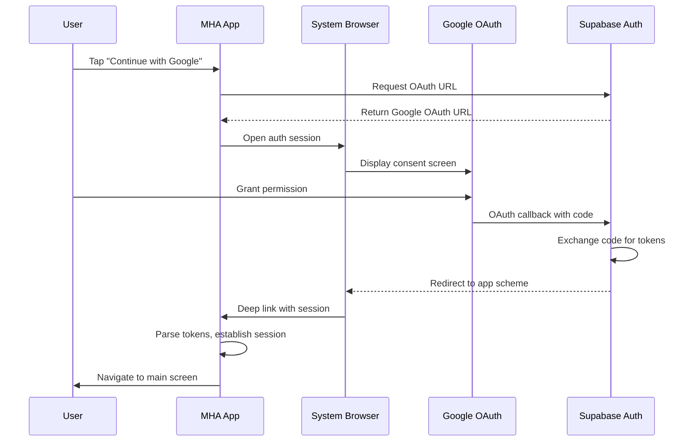

# Design Document: Google Sign-In

## Overview

This design implements Google Sign-In for the Metabolic Health App using Expo and Supabase. The implementation leverages Supabase's built-in OAuth support with Google as the identity provider. The flow uses `expo-web-browser` to open a secure browser session for Google authentication, then handles the OAuth callback via deep linking to establish the user session.

## Architecture



## Components and Interfaces

### 1. AuthService (Enhanced)

The existing `AuthService` already has `signInWithGoogle()` method. We need to enhance it to properly handle the callback.

```typescript
// services/supabase/auth.ts
interface GoogleSignInResult {
  url: string | null;
  error?: string;
}

// Enhanced method signature
static async signInWithGoogle(): Promise<GoogleSignInResult>
static async handleOAuthCallback(url: string): Promise<{ success: boolean; error?: string }>
```

### 2. AuthContext (Enhanced)

Add callback handling to the context:

```typescript
interface AuthContextType {
  // ... existing methods
  googleSignIn: () => Promise<string | null>;
  handleAuthCallback: (url: string) => Promise<void>;
}
```

### 3. Deep Link Handler

A new component/hook to handle incoming deep links:

```typescript
// hooks/useDeepLinkHandler.ts
export function useDeepLinkHandler(): void
```

### 4. App Layout (Enhanced)

The root `_layout.tsx` needs to listen for deep links and route OAuth callbacks.

## Data Models

No new data models required. Google Sign-In uses the existing Supabase `User` model with additional metadata:

```typescript
// User metadata from Google OAuth
interface GoogleUserMetadata {
  avatar_url?: string;
  email?: string;
  email_verified?: boolean;
  full_name?: string;
  iss?: string;
  name?: string;
  picture?: string;
  provider_id?: string;
  sub?: string;
}
```

## Correctness Properties

*A property is a characteristic or behavior that should hold true across all valid executions of a system-essentially, a formal statement about what the system should do. Properties serve as the bridge between human-readable specifications and machine-verifiable correctness guarantees.*

### Property 1: OAuth Callback URL Parsing

*For any* valid OAuth callback URL containing access_token and refresh_token parameters, parsing the URL SHALL extract both tokens correctly and they SHALL be non-empty strings.

**Validates: Requirements 1.2, 2.3**

### Property 2: Redirect URI Scheme Consistency

*For any* generated OAuth redirect URI, the scheme portion SHALL match the app scheme defined in app.json configuration.

**Validates: Requirements 2.1, 2.2, 5.2**

## Error Handling

| Error Scenario | User Message | Technical Action |
|----------------|--------------|------------------|
| User cancels OAuth | None (silent return) | Return to login screen |
| Network unavailable | "Network error. Please check your connection." | Log error, show alert |
| Invalid redirect URI | "Authentication configuration error." | Log detailed error for debugging |
| Supabase session exchange fails | "Authentication failed. Please try again." | Log error, clear partial state |
| Google OAuth error | "Google sign-in failed. Please try again." | Log error code, show alert |

## Testing Strategy

### Unit Tests

- Test redirect URI generation matches app scheme
- Test error message mapping for different error types
- Test loading state transitions

### Property-Based Tests

Using `fast-check` for property-based testing:

- **Property 1**: Generate random valid OAuth callback URLs and verify token extraction
- **Property 2**: Verify redirect URI scheme consistency across multiple generations

Each property-based test will:
- Run a minimum of 100 iterations
- Be tagged with the format: `**Feature: google-signin, Property {number}: {property_text}**`

---

## Supabase Configuration Guide

### Step 1: Enable Google Provider in Supabase

1. Go to your Supabase Dashboard → Authentication → Providers
2. Find "Google" in the list and click to expand
3. Toggle "Enable Sign in with Google" to ON
4. You'll see fields for:
   - Client ID (from Google Cloud Console)
   - Client Secret (from Google Cloud Console)

### Step 2: Create Google OAuth Credentials

1. Go to [Google Cloud Console](https://console.cloud.google.com/)
2. Create a new project or select existing one
3. Navigate to "APIs & Services" → "Credentials"
4. Click "Create Credentials" → "OAuth client ID"
5. Select "Web application" as the application type
6. Add a name (e.g., "MHA Supabase Auth")
7. Under "Authorized redirect URIs", add:
   ```
   https://<your-project-ref>.supabase.co/auth/v1/callback
   ```
   (Replace `<your-project-ref>` with your actual Supabase project reference)
8. Click "Create" and copy the Client ID and Client Secret

### Step 3: Configure Supabase with Google Credentials

1. Back in Supabase Dashboard → Authentication → Providers → Google
2. Paste the Client ID and Client Secret from Google Cloud Console
3. Click "Save"

### Step 4: Configure Redirect URLs in Supabase

1. Go to Authentication → URL Configuration
2. Add your app's deep link to "Redirect URLs":
   ```
   client://auth/callback
   ```
   (This matches the `scheme` in your app.json: "client")

### Step 5: Update Environment Variables

In your `.env` file, ensure you have:
```
EXPO_PUBLIC_SUPABASE_URL=https://<your-project-ref>.supabase.co
EXPO_PUBLIC_SUPABASE_ANON_KEY=<your-anon-key>
```

### Step 6: For Production (EAS Build)

When building with EAS for production, you may need additional configuration:

1. **iOS**: Add URL scheme to `app.json`:
   ```json
   {
     "expo": {
       "scheme": "client",
       "ios": {
         "bundleIdentifier": "com.yourcompany.mha"
       }
     }
   }
   ```

2. **Android**: The scheme is already configured. Ensure the package name matches:
   ```json
   {
     "expo": {
       "android": {
         "package": "com.lordchris.getwell"
       }
     }
   }
   ```

### Verification Checklist

- [ ] Google OAuth credentials created in Google Cloud Console
- [ ] Client ID and Secret added to Supabase Google provider
- [ ] `client://auth/callback` added to Supabase Redirect URLs
- [ ] App scheme "client" matches redirect URI scheme
- [ ] Environment variables set correctly
