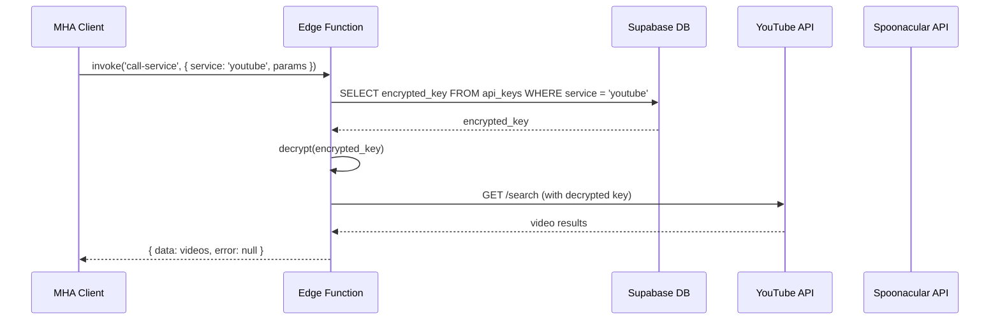

# Design Document: Secure API Keys with Edge Functions

## Overview

This design implements secure API key management using Supabase Edge Functions. The architecture follows a proxy pattern where the client never has access to API keys. Instead, the client calls an Edge Function which retrieves the encrypted API key from the database, decrypts it server-side, calls the external API, and returns the results.

## Architecture



## Components and Interfaces

### 1. Edge Function: `call-service`

The main Edge Function that proxies requests to external APIs.

```typescript
// supabase/functions/call-service/index.ts
interface CallServiceRequest {
  service: 'youtube' | 'spoonacular';
  action: string;
  params: Record<string, any>;
}

interface CallServiceResponse {
  data: any | null;
  error: { code: string; message: string } | null;
}
```

### 2. Updated ApiKeyService (Client-side)

Simplified service that calls Edge Functions instead of fetching keys directly.

```typescript
// services/config/ApiKeyService.ts
export class SecureApiService {
  static async callService(
    service: 'youtube' | 'spoonacular',
    action: string,
    params: Record<string, any>
  ): Promise<{ data: any; error: any }>;
}
```

### 3. Updated YouTubeService

Modified to use Edge Function instead of direct API calls.

```typescript
// services/apis/YouTubeService.ts
export class YouTubeService {
  static async searchVideos(params: YouTubeSearchParams): Promise<YouTubeVideo[]>;
  static async getHealthVideos(category: string): Promise<YouTubeVideo[]>;
}
```

### 4. Database Schema: `api_keys` table

```sql
CREATE TABLE api_keys (
  id UUID PRIMARY KEY DEFAULT gen_random_uuid(),
  service VARCHAR(50) NOT NULL,
  name VARCHAR(100),
  encrypted_key TEXT NOT NULL,
  is_active BOOLEAN DEFAULT true,
  created_at TIMESTAMPTZ DEFAULT NOW(),
  updated_at TIMESTAMPTZ DEFAULT NOW()
);

-- Index for fast lookups
CREATE INDEX idx_api_keys_service_active ON api_keys(service, is_active);
```

## Data Models

### Edge Function Request/Response

```typescript
// Request to Edge Function
interface ServiceRequest {
  service: 'youtube' | 'spoonacular';
  action: 'search' | 'details' | 'random';
  params: {
    query?: string;
    maxResults?: number;
    videoId?: string;
    diet?: string;
    cuisine?: string;
    // ... other service-specific params
  };
}

// Response from Edge Function
interface ServiceResponse<T> {
  data: T | null;
  error: {
    code: 'INVALID_SERVICE' | 'INVALID_PARAMS' | 'API_ERROR' | 'RATE_LIMITED' | 'KEY_NOT_FOUND';
    message: string;
  } | null;
}
```

## Correctness Properties

*A property is a characteristic or behavior that should hold true across all valid executions of a system-essentially, a formal statement about what the system should do. Properties serve as the bridge between human-readable specifications and machine-verifiable correctness guarantees.*

### Property 1: Service Routing

*For any* valid service request with service parameter 'youtube' or 'spoonacular', the Edge Function SHALL route the request to the corresponding external API.

**Validates: Requirements 2.2, 3.2, 4.1**

### Property 2: Response Transformation

*For any* successful external API response, the Edge Function SHALL return a response with `data` containing the transformed results and `error` set to null.

**Validates: Requirements 2.3, 3.3**

### Property 3: Error Response Structure

*For any* error scenario (API failure, rate limiting, invalid request), the Edge Function SHALL return a response with `data` set to null and `error` containing a code and message.

**Validates: Requirements 2.4, 3.4, 5.2**

### Property 4: Request Validation

*For any* request with missing or invalid required parameters, the Edge Function SHALL reject the request with an INVALID_PARAMS error before making external API calls.

**Validates: Requirements 4.3, 5.4**

## Error Handling

| Error Scenario | Error Code | User Message |
|----------------|------------|--------------|
| Unknown service | INVALID_SERVICE | "Service not supported" |
| Missing required params | INVALID_PARAMS | "Missing required parameters" |
| API key not found | KEY_NOT_FOUND | "Service temporarily unavailable" |
| External API error | API_ERROR | "Failed to fetch data" |
| Rate limit exceeded | RATE_LIMITED | "Too many requests, please try again later" |
| Network error | NETWORK_ERROR | "Network error, please check connection" |

## Testing Strategy

### Unit Tests

- Test request validation logic
- Test response transformation functions
- Test error code mapping

### Property-Based Tests

Using `fast-check` for property-based testing:

- **Property 1**: Generate random valid service requests and verify routing
- **Property 2**: Generate random API responses and verify transformation
- **Property 3**: Generate random error scenarios and verify error structure
- **Property 4**: Generate random invalid requests and verify rejection

Each property-based test will:
- Run a minimum of 100 iterations
- Be tagged with the format: `**Feature: secure-api-keys, Property {number}: {property_text}**`

---

## Implementation Guide

### Step 1: Set Up Supabase CLI

```bash
# Install Supabase CLI
npm install -g supabase

# Login to Supabase
supabase login

# Link to your project
supabase link --project-ref <your-project-ref>
```

### Step 2: Create the Edge Function

```bash
# Create the function
supabase functions new call-service
```

### Step 3: Deploy the Edge Function

```bash
# Deploy to Supabase
supabase functions deploy call-service
```

### Step 4: Set Environment Variables

In Supabase Dashboard → Edge Functions → call-service → Settings:
- `ENCRYPTION_KEY` - Key used to decrypt API keys (generate a secure 32-byte key)

### Step 5: Update Database Schema

Run the SQL migration to create/update the `api_keys` table with encryption support.

### Step 6: Store Encrypted API Keys

Use the encryption key to encrypt your API keys before storing them in the database.

### Encryption Approach

For simplicity, we'll use AES-256-GCM encryption:

```typescript
// Server-side encryption/decryption
import { createCipheriv, createDecipheriv, randomBytes } from 'crypto';

function encrypt(text: string, key: string): string {
  const iv = randomBytes(16);
  const cipher = createCipheriv('aes-256-gcm', Buffer.from(key, 'hex'), iv);
  let encrypted = cipher.update(text, 'utf8', 'hex');
  encrypted += cipher.final('hex');
  const authTag = cipher.getAuthTag().toString('hex');
  return `${iv.toString('hex')}:${authTag}:${encrypted}`;
}

function decrypt(encryptedData: string, key: string): string {
  const [ivHex, authTagHex, encrypted] = encryptedData.split(':');
  const decipher = createDecipheriv('aes-256-gcm', Buffer.from(key, 'hex'), Buffer.from(ivHex, 'hex'));
  decipher.setAuthTag(Buffer.from(authTagHex, 'hex'));
  let decrypted = decipher.update(encrypted, 'hex', 'utf8');
  decrypted += decipher.final('utf8');
  return decrypted;
}
```

### Security Considerations

1. **Never commit encryption keys** - Use environment variables
2. **Rotate keys periodically** - Update encryption keys and re-encrypt stored keys
3. **Use service_role only in Edge Functions** - Never expose in client code
4. **Validate all inputs** - Prevent injection attacks
5. **Rate limit Edge Function** - Prevent abuse
