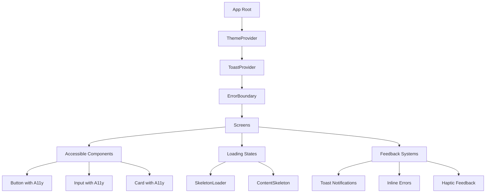

# Design Document: UI/UX Modernization

## Overview

This design implements UI/UX modernization for the Metabolic Health App, focusing on accessibility (WCAG 2.1 compliance), modern loading states (skeleton loaders), toast notifications, form validation improvements, and dark mode support. The implementation prioritizes user experience and app store compliance.

## Architecture



## Components and Interfaces

### 1. Accessible Button Component

```typescript
interface AccessibleButtonProps {
  title: string;
  onPress: () => void;
  disabled?: boolean;
  loading?: boolean;
  variant?: 'primary' | 'secondary' | 'outline';
  accessibilityHint?: string;
}
```

### 2. Toast Notification System

```typescript
interface ToastConfig {
  type: 'success' | 'error' | 'warning' | 'info';
  message: string;
  duration?: number; // default 3000ms
  position?: 'top' | 'bottom';
}

interface ToastContextValue {
  showToast: (config: ToastConfig) => void;
  hideToast: () => void;
}
```

### 3. Skeleton Loader Component

```typescript
interface SkeletonProps {
  width?: number | string;
  height?: number;
  borderRadius?: number;
  style?: ViewStyle;
}

interface ContentSkeletonProps {
  type: 'card' | 'list' | 'profile' | 'recipe';
  count?: number;
}
```

### 4. Form Validation Utilities

```typescript
interface ValidationResult {
  isValid: boolean;
  error?: string;
}

interface PasswordStrength {
  level: 'weak' | 'fair' | 'good' | 'strong';
  score: number; // 0-100
  suggestions: string[];
}
```

## Data Models

### Theme Colors

```typescript
interface ThemeColors {
  primary: string;
  secondary: string;
  background: string;
  surface: string;
  text: string;
  textSecondary: string;
  error: string;
  success: string;
  warning: string;
  border: string;
}

interface Theme {
  isDarkMode: boolean;
  colors: ThemeColors;
  gradients: Record<string, string[]>;
}
```

### Accessibility Props

```typescript
interface AccessibilityProps {
  accessibilityRole: AccessibilityRole;
  accessibilityLabel: string;
  accessibilityHint?: string;
  accessibilityState?: {
    disabled?: boolean;
    busy?: boolean;
    selected?: boolean;
  };
}
```

## Correctness Properties

*A property is a characteristic or behavior that should hold true across all valid executions of a system-essentially, a formal statement about what the system should do. Properties serve as the bridge between human-readable specifications and machine-verifiable correctness guarantees.*

### Property 1: Button Accessibility Completeness

*For any* Button component instance, the component SHALL include accessibilityRole="button", a non-empty accessibilityLabel, and accessibilityState reflecting disabled/loading state.

**Validates: Requirements 1.1**

### Property 2: Input Accessibility Completeness

*For any* Input component instance with a label prop, the component SHALL include accessibilityLabel matching the label text.

**Validates: Requirements 1.2**

### Property 3: Toast Message Preservation

*For any* toast notification with a message string, the rendered toast SHALL display the exact message string provided.

**Validates: Requirements 3.1**

### Property 4: Toast Auto-Dismiss Timing

*For any* toast notification with a specified duration, the toast SHALL become hidden after the duration elapses (within 100ms tolerance).

**Validates: Requirements 3.2**

### Property 5: Email Validation Correctness

*For any* string input, the email validation function SHALL return isValid=true only for strings matching standard email format (contains @ and valid domain).

**Validates: Requirements 4.1**

### Property 6: Password Strength Monotonicity

*For any* two passwords where password A is a prefix of password B (B has additional characters), the strength score of B SHALL be greater than or equal to the strength score of A.

**Validates: Requirements 4.2**

### Property 7: Theme Color Consistency

*For any* theme mode (dark or light), all color values in the theme SHALL be valid hex color strings or rgba values.

**Validates: Requirements 7.1**

## Error Handling

| Error Scenario | Handling Strategy | User Feedback |
|----------------|-------------------|---------------|
| Form validation error | Inline error message | Red text below field |
| API error | Toast notification | "Something went wrong" with retry |
| Network error | Toast + offline indicator | "No internet connection" |
| Component crash | Error boundary | Fallback UI with retry |

## Testing Strategy

### Unit Tests

- Test accessibility prop generation functions
- Test validation utility functions
- Test theme color generation
- Test toast state management

### Property-Based Tests

Using `fast-check` for property-based testing:

- **Property 1**: Generate random button props and verify accessibility completeness
- **Property 2**: Generate random input props and verify accessibility labels
- **Property 3**: Generate random toast messages and verify preservation
- **Property 4**: Generate random durations and verify auto-dismiss timing
- **Property 5**: Generate random strings and verify email validation
- **Property 6**: Generate random passwords and verify strength monotonicity
- **Property 7**: Generate theme modes and verify color validity

Each property-based test will:
- Run a minimum of 100 iterations
- Be tagged with the format: `**Feature: ui-ux-modernization, Property {number}: {property_text}**`

## Implementation Notes

### Accessibility Guidelines

1. All interactive elements must have `accessibilityRole`
2. All buttons must have `accessibilityLabel` describing the action
3. Loading states must set `accessibilityState={{ busy: true }}`
4. Disabled states must set `accessibilityState={{ disabled: true }}`

### Toast System Guidelines

1. Success toasts: 2000ms duration, green color
2. Error toasts: 4000ms duration, red color, manual dismiss option
3. Warning toasts: 3000ms duration, orange color
4. Info toasts: 3000ms duration, blue color

### Skeleton Loader Guidelines

1. Match the approximate dimensions of actual content
2. Use shimmer animation (left to right)
3. Use theme-aware colors (lighter in dark mode)
